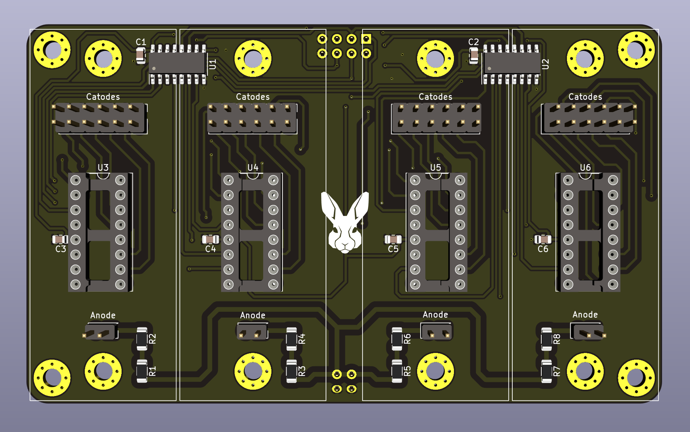
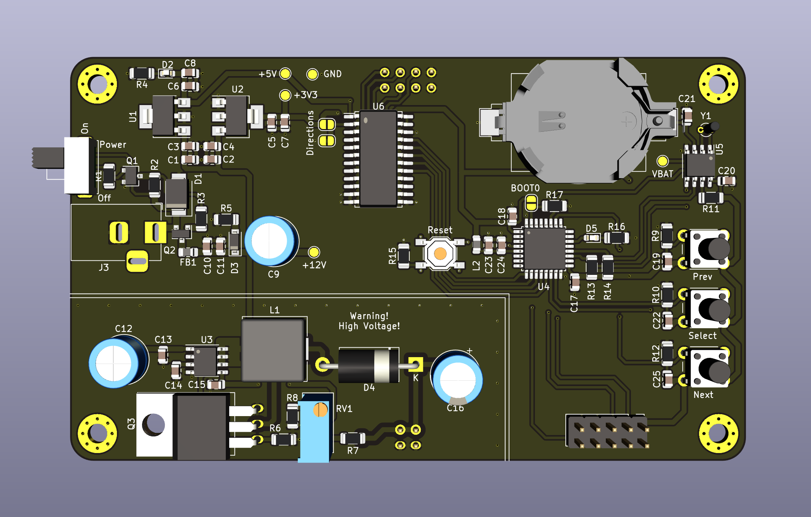

# NixieClock

It's a custom design nixie clock, with code, schematics and board design.

## Design

### Nixie Clock - Controller

Source: ./design/NixieDisplayControllerV2

### Nixie Clock - Mother Board

Source: ./design/NixieDisplayMotherBoardV2

## Assembly

Under the folder assembly, you can find the generated files from kicad or if you want to order directly from JLCPB, then the compressed files ending with {Board_Name}_Gerber.zip can be used.

## Code

The mother board is controlled by an STM32L031 MCU and the code is created by using STMCube IDE. To upload the code, you just need to import the project and using an ST Link, you just need to upload directly to the chip. (No USART exposed)